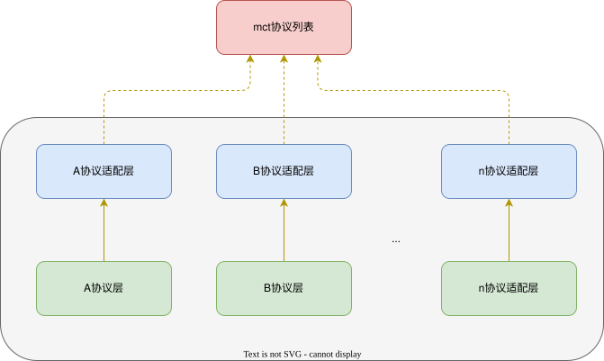

[中文](list.md) | English

# mct Instance Interface Adaptation

## Protocol Registration
mct registers protocols via the `modemList[]` array in `mctlist.c` to identify which protocol is used by each instance.
```
const tModemList modemList[] =
{
    {.name = "CONSOLE",    .api = mctConsoleApiGet},
    {.name = "A7680C",     .api = mctA7680CApiGet},
    {.name = "Y7025",      .api = mctY7025ApiGet},
};
```
Users can add any number of protocols to the list for mct to register and select.

## Protocol Construction
1. Each protocol is divided into a **protocol layer** and a **protocol adapter layer**.  
2. The protocol adapter layer is what gets added to `modemList[]`.



Create a new protocol folder under the `list` directory, e.g., for a protocol named `xprotocol`:
|-xprotocol  
&nbsp;&nbsp;|-command_xprotocol.c  
&nbsp;&nbsp;|-command_xprotocol.h  
&nbsp;&nbsp;|-command_xprotocolAdapter.c  
&nbsp;&nbsp;|-command_xprotocolAdapter.h  

### Protocol Layer
The protocol layer provides packing and parsing interfaces for command formats.  
For example, for the following AT command frame interaction:
```
MCU disables module echo
mcu->mod : ATI0\r\n 

Module replies echo disabled successfully
mod->mcu : OK\r\n ATI0:0\r\n
```

1. Add packing and parsing interfaces for the command format:
```
/**
 * @fn cmd_PackATcommand
 * @brief AT command frame packing interface
 * 
 * @param [in] buf - pointer to the packed command frame buffer
 * @param [in] len - pointer to the packed frame length
 * @param [in] para - user parameter for packing
 * @retval None
 */
static bool cmd_PackATcommand(uint8_t* buf, size_t *len, void *para)
{
    uint8_t *echo = (uint8_t *)para;
    // Pack buf in ATE<X> format, where X is echo
    return true;
}
```
```
/**
 * @fn cmd_AnalyzeATcommand
 * @brief AT command frame parsing interface
 * 
 * @param [in] buf - pointer to the received frame buffer
 * @param [in] len - length of the received frame
 * @param [in] para - pointer to application data to return
 * @retval None
 */
static bool cmd_AnalyzeATcommand(uint8_t* buf, size_t len, void *para)
{
    uint8_t *echo = (uint8_t *)para;
    // Parse len bytes in buf with expected format ATE:<X>, assign X to echo
    return true;
}
```

2. Construct protocol command interface:  
The protocol uses the **tCmd** structure for description. A single command parameter is defined as follows:  
**ASCII Protocol**  
Frame ID | Timeout | Frame Header | Frame Tail | Error Field | Frame Type | Pack & Parse Function Name

```
CMD_ADD(CMD_CONSOLE_ID_REV, 2,  "$$COMX$$","*#*#",  NULL,  RecvSend,  RevFlow),
```
**Byte Stream Protocol**  
Frame ID | Timeout | Header | Header Len | Tail | Tail Len | Error Field | Error Len | Frame Type | Pack & Parse Function Name
```
CMD_HEX_ADD(CMD_CONSOLE_ID_REV2,   2,  &header,sizeof(header),      &tail,sizeof(header),       NULL,0,   RecvSend RevHexFlow),
```

## User-defined Framing (CUSTOM)
Use custom framing when the boundary is not a fixed "header + tail" (e.g. the frame length comes from a **length field** inside the frame, or you need unescaping / table lookup). **The framework first locates the header, then calls your framing callback; the callback decides where the frame ends.**

### Framing callback
```c
/**
 * @brief User framing callback
 * @param[in]  buffer  First byte of the located header: buffer[0] is the header
 * @param[in]  len     Bytes currently available starting from the header
 * @param[out] start   [out] frame start (relative to buffer), normally 0
 * @param[out] end     [out] frame end (relative to buffer, half-open); frame length = end - start
 * @param[in]  user_arg User context registered in the macro, passed through as-is; may be NULL
 * @return FRAME_SCAN_MATCH frame complete; FRAME_SCAN_NEED_MORE wait for more; FRAME_SCAN_NO_HEAD no valid frame
 */
static frame_scan_result_t my_frame_cb(const uint8_t *buffer, uint16_t len,
                                      uint16_t *start, uint16_t *end, void *user_arg);
```
Notes:
- All offsets are **relative to `buffer` (the first header byte)**; you do not deal with the global buffer or cursor.
- Return `FRAME_SCAN_NEED_MORE` while data is incomplete; the framework keeps waiting and **never cuts a half frame or drops bytes**.
- After the callback returns, the framework checks `start < end` and `end <= len`; an out-of-range result is rejected (so a buggy callback cannot cause an overflow or an infinite loop).

### Two macros (ASCII header / Hex header)
```
CMD_CUSTOM_ADD(id, timeout, header_str, callback, cb_arg, type, FunName, ...)
CMD_CUSTOM_HEX_ADD(id, timeout, header, header_len, callback, cb_arg, type, FunName, ...)
```
- The framework locates the header the same way as `CMD_ADD / CMD_HEX_ADD`; **the callback is not invoked when the header is not found**.
- `FunName` still requires the corresponding `cmd_PackFunName / cmd_AnalyzeFunName`.
- You can still use `STICKY_VAR / STICKY_CB` in the `...` position.

### Full example
Frame `7E 08 cmd rsv len payload.. crc`; the 5th byte (offset 4 from the header) is the payload length:
```c
static frame_scan_result_t my_frame_cb(const uint8_t *b, uint16_t len,
                                      uint16_t *start, uint16_t *end, void *arg)
{
    uint8_t payload_len = 0;
    uint16_t total = 0;
    (void)arg;

    if (len < 5) { return FRAME_SCAN_NEED_MORE; } /* header2+cmd+rsv+length field */
    payload_len = b[4];                          /* 5th byte is the length */
    total = (uint16_t)(6 + payload_len);         /* 5 prefix + payload + crc */
    if (total > len) { return FRAME_SCAN_NEED_MORE; }

    *start = 0;
    *end = total;
    return FRAME_SCAN_MATCH;
}

static const uint8_t my_head[] = { 0x7E, 0x08 };
CMD_CUSTOM_HEX_ADD(CMD_MY_ID, 2, my_head, sizeof(my_head),
                   my_frame_cb, NULL, RecvSend, MyFlow, STICKY_VAR(&my_ctx)),
```

## Sticky-frame handling
Because the mct library includes an automatic sticky-frame handling mechanism, when handling sticky frames the pack/analyze functions automatically receive the STICKY parameter defined in CMD_ADD (for example STICKY_VAR(&echo) or STICKY_CB(get_echo)) as the data pointer, rather than the main-flow parameter.

It is strongly recommended to add this field to any frames that are at risk of sticky-frame issues！

Sticky-frame handling provides two interfaces to obtain the sticky-frame data pointer:

1. Variable mode:
```
static uint8_t echo;
CMD_ADD(CMD_CONSOLE_ID_REV, 2, "$$COMX$$", "*#*#", NULL, RecvSend, RevFlow, STICKY_VAR(&echo)),
```

2. Callback function mode:
```
void* get_echo(void)
{
    return &echo;
}
CMD_ADD(CMD_CONSOLE_ID_REV, 2, "$$COMX$$", "*#*#", NULL, RecvSend, RevFlow, STICKY_CB(get_echo)),
```

Note: STICKY_VAR and STICKY_CB are also applicable to CMD_HEX_ADD and work the same way.

## Protocol Adapter Layer
1. Build the tCmdApi structure list
```
static bool cmd_revHandle(MctInstance *inst, void *para)
{
    command_t console_cmd = {0};
    return mct_console_execute(inst, NULL_CMD_SEEK, &console_cmd);
}

static const tCmdApi funList[] =
{
    {.id = CMD_REV_FLOW, .fun = cmd_revHandle},
};

tCmdApi const *mctConsoleApiGet(void)
{
    return funList;
}
```

2. Register to mctList
```
const tModemList modemList[] =
{
    {.name = "CONSOLE", .api = mctConsoleApiGet},
};
```

## Important Notes
1. Specifying a RevSend command ID in the adapter layer will disable the automatic sticky-frame handling; only the requested command ID will be processed and other messages will be ignored automatically.  
2. The system reserves the command ID: NULL_CMD_SEEK. This command is intended for use with RevSend. When called, the system in RevSend mode will enable sticky-frame handling and return the STICKY data pointer for that command.
